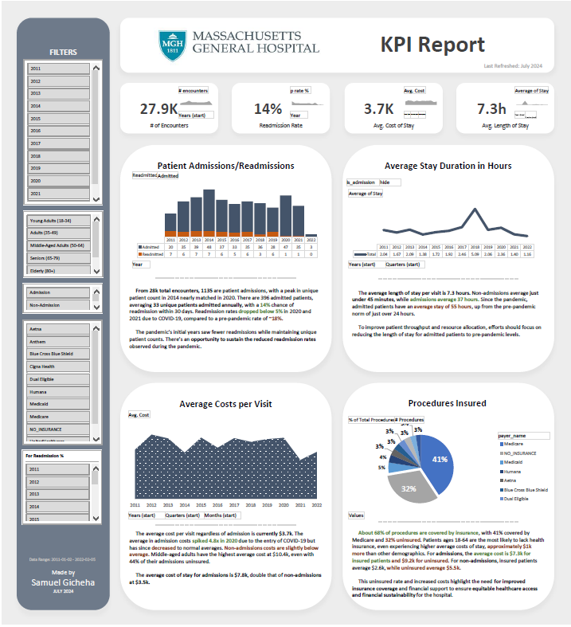

# Massachusetts Hospital KPI Report

## Project Background

As an Analytics Consultant for Massachusetts General Hospital (MGH), I was tasked with developing a high-level KPI report for the executive team. **This report uses 28k synthetic patient records from 2011 to 2022, covering approximately 1,000 patients' demographics, insurance coverage, and medical encounters**. The goal was to transform this data into actionable insights to reflect the hospital’s performance over the years. The analysis focused on key areas such as patient admissions, readmissions, length of stay, and procedural costs, providing strategic insights to drive decision-making.

## Executive Summary

This analysis provides a snapshot of MGH’s performance across patient admissions, readmissions, length of stay, and cost per visit. From 28,000 total encounters, 1,135 were classified as admissions. Notably, the readmission rate significantly dropped during the pandemic, and average costs surged in 2020 due to COVID-19. These insights suggest opportunities for operational improvements and cost reductions, especially among uninsured patients, who face notably higher expenses.

## Insights Deep-Dive

- **Patient Admissions & Readmissions**:
    - **1,135 patient admissions** were identified from 28,000 encounters.
    - **396 unique patients** were admitted, with a peak in unique admissions in 2014 and 2020.
    - **14% readmission rate** within 30 days, which dropped below 5% during 2020-2021 due to COVID-19.
    - The hospital has an opportunity to capitalize on the post-pandemic readmission drop by maintaining improved operational practices.
  
- **Length of Stay**:
    - The average length of stay per visit is **7.3 hours**.
    - The average length of stay for admitted patients was **37 hours**, while non-admitted patients averaged **just under 45 minutes**.
    - Since the pandemic, the average length of stay for admissions has risen to **55 hours**, compared to just over 24 hours pre-pandemic.
    - **Reducing admitted patients’ length of stay** to pre-pandemic levels will be essential for improving patient throughput and resource allocation.

- **Cost Analysis**:
    - The average cost per visit stands at **$3.7k** across all encounters.
    - The average cost of stay for admissions is **$7.8k**, double that of non-admissions at $3.5k.
    - Admission costs surged by 4.8x during the pandemic in 2020 due to COVID-19.
    - **Uninsured patients** have higher average costs: **$9.2k** for admissions versus **$7.3k** for insured patients.
    - The data suggests that **uninsured patients** have disproportionately higher medical costs, especially middle-aged adults with the **highest average cost at $10.4k** with 44% of admissions uninsured.

- **Insurance Coverage**:
    - About **68% of procedures are covered by insurance**, with 41% of those procedures covered by Medicare and 32% of all procedures uninsured.
    - Patients ages 18-64 are the most likely to lack health insurance, experiencing higher average costs of stay, approximately **$1k more than other demographics**.
    - For admissions, the average cost is $7.3k for insured patients and **$9.2k for uninsured**.
    - For non-admissions, insured patients average $2.6k, while uninsured average $5.5k.
    - This uninsured rate and increased costs highlight the need for **improved insurance coverage and financial support** to ensure equitable healthcare access and financial sustainability for the hospital.

## Recommendations

- **Sustain Low Readmission Rates**: MGH should continue to implement the changes introduced during the pandemic that helped reduce the readmission rate to below 5%.
  
- **Improve Patient Throughput**: Reducing the length of stay for admitted patients to pre-pandemic levels is critical for optimizing hospital resources and improving patient throughput.
  
- **Increase Insurance Coverage**: The hospital should work on initiatives to improve insurance coverage among patients, particularly for those in high-cost demographics such as middle-aged adults.

- **Support for Uninsured Patients**: Implementing financial assistance programs for uninsured patients could alleviate the burden of high medical costs and improve access to care.

## Key Questions for Stakeholders Prior to Project Advancement

> These are some questions I would've loved to ask stakeholders/project leads to learn more about their own needs/existing knowledge on the objective at hand.

- What interval do you use for measuring readmissions: 30, 60, or 90 days after a previous admission?
- Should readmissions be related to the same medical conditions or reasons as the initial admission?
- How are encounter entries recorded? Given that some admissions are logged exactly 24 hours apart, how should these be treated? Are these entries reset daily, or should they be considered continuous admissions?

## Assumptions and Caveats

- The readmission rates are based on a **30-day interval** for returning patients.
- Encounters are considered readmissions regardless of previous reason for visit.
- Drop in readmission rate on 2020 onwards was assumed to be caused by the pandemic.
- **Length of stay** calculations only include encounters labeled as inpatient admissions.
- Cost data reflects a spike in expenses during the pandemic period (2020), which may not represent typical operational conditions.
- Excel on Mac posed specific challenges, particularly with functions like 'Distinct Count' in pivot tables, which affected the interactivity of dashboard elements like admissions. Moving to a more robust data visualization tool like Tableau would've streamlined this process.
